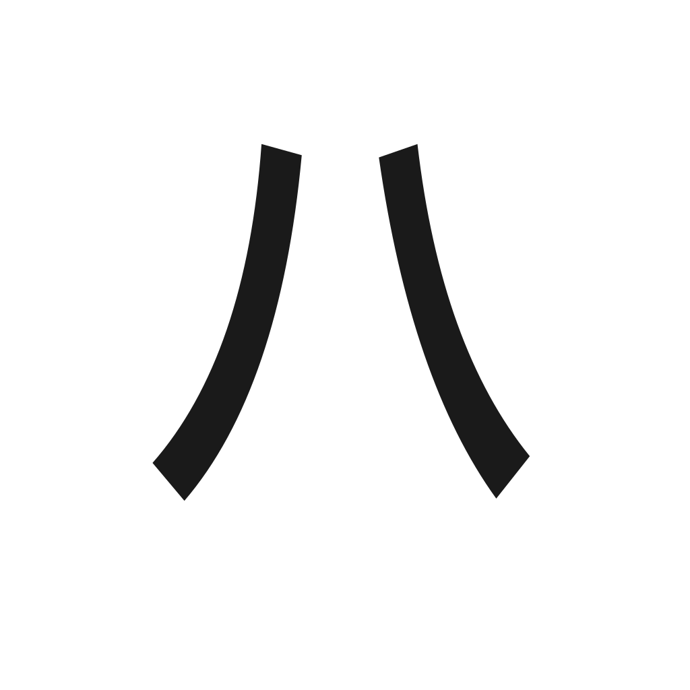

# AnimeHat Website

### Full-featured watcher
Discover and watch anime, cartoon and more – easier than ever on your Android device.

## Contributing

[Code of conduct](./CODE_OF_CONDUCT.md) · [Contributing guide](./CONTRIBUTING.md)

Pull requests are welcome. For major changes, please open an issue first to discuss what you would like to change.

If you got any questions, [join our Discord server](https://discord.gg/WmEEQ5Q3e5).

### Repositories

### Credits

Thank you to all the people who have contributed!

### Disclaimer

The developer(s) of this application does not have any affiliation with the content providers available, and this application hosts zero content.

### License

<pre>
Copyright © 2026 The AnimeHat Open Source Project

This Source Code Form is subject to the terms of the Mozilla Public
License, v. 2.0. If a copy of the MPL was not distributed with this
file, You can obtain one at http://mozilla.org/MPL/2.0/.
</pre>

# AnimeHatWepsite
# AnimeHatWepsite
# AnimeHatWepsite
# AnimeHatWepsite
# AnimeHatWepsite
